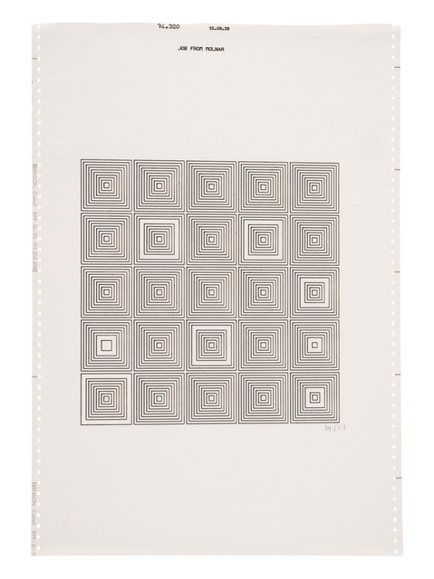
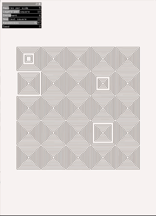
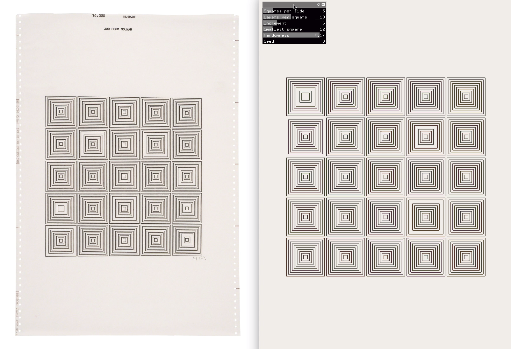
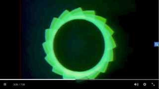
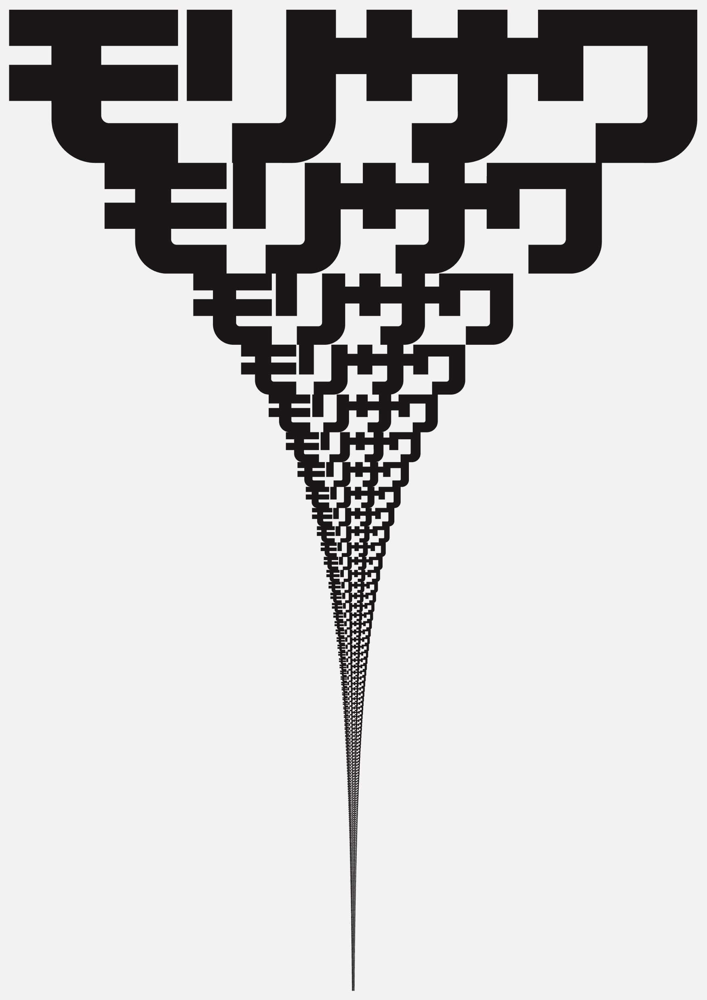
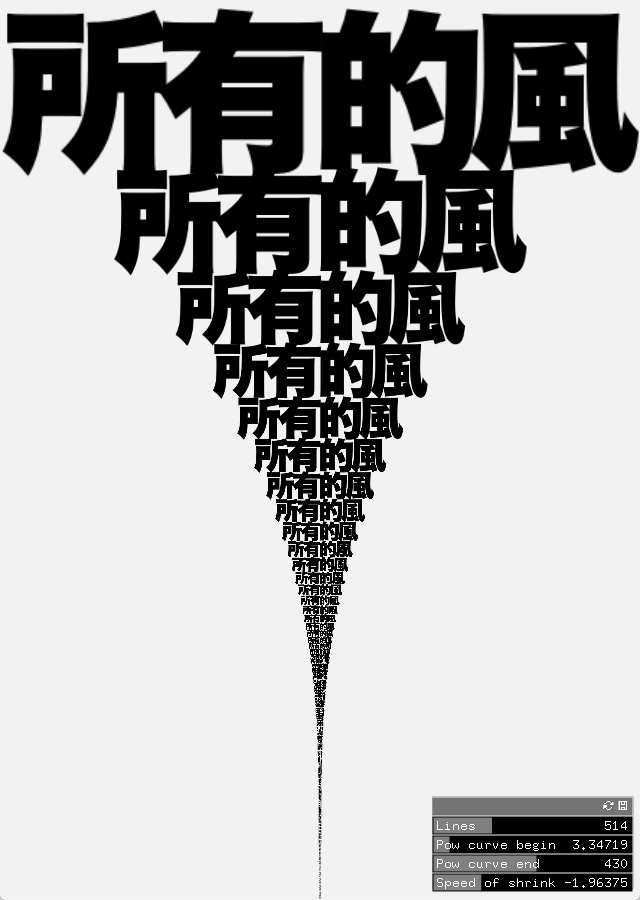

# RecreatingThePast_SFPC
Class at School for Poetic Computation with Zach

More about the class:
https://sfpc.io/recreatingthepast-spring2020/

Webring of Fellow Classmates:
- [Norm](https://www.are.na/norman-o-hagan/recreating-the-past-shenanigans-summer-2020)
- [Deniz](https://github.com/DenizBicer/RTP)
- [Lisa](https://github.com/lisajamhoury/sfpc_rtp_hw)
- [Edgardo](https://github.com/eaviles/sfpc-2020-rtp)

---

## Vera Molnar
Recreating Vera Molnár's [Untitled 13](https://www.artsy.net/artwork/vera-molnar-untitled-13-1)
| Original | Recreation | Playful Recreation |
| --- | --- | --- |
|  |  |  |

<!-- 

3D interactive version
 -->

## John Whitney
| Original | Recreation |
| --- | --- |
|  |  |

## John Maeda
| Original | Recreation |
| --- | --- |
|  |  |

Curve finder with GUI

